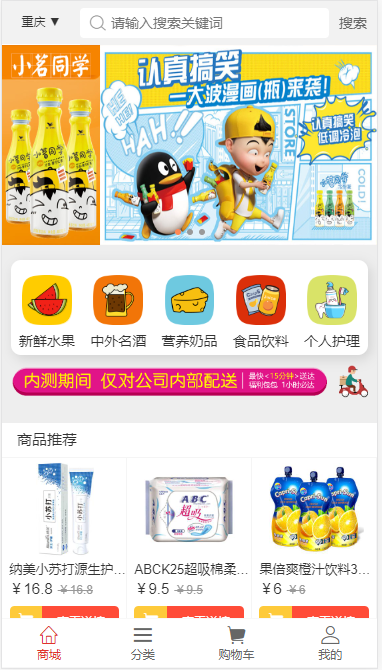
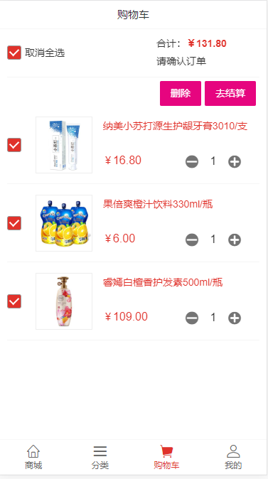
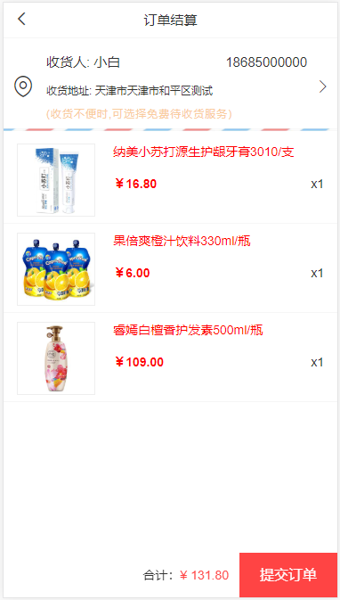
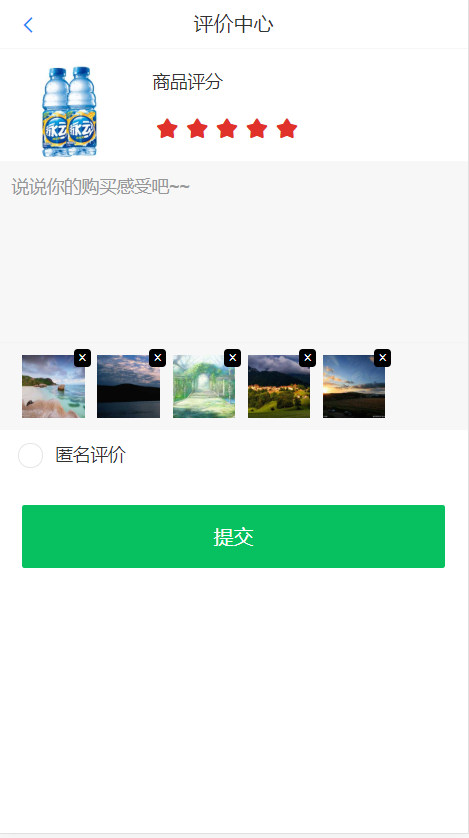
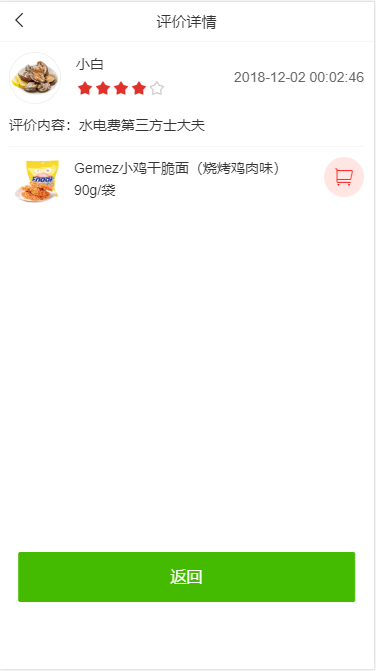
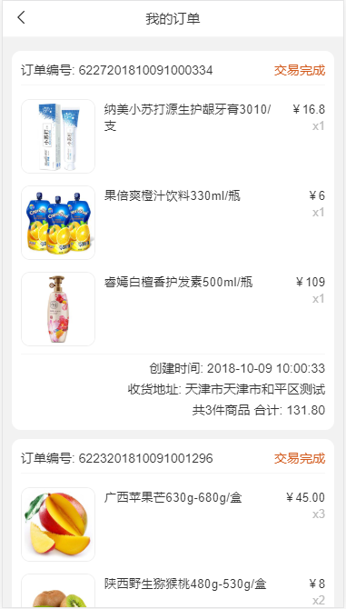

# shoppingMall-React

> 一个基于 **<abbr title="Hyper Text Markup Language">React16.8 + egg.js + mongodb + Zarm </abbr>** 的电商webapp网站,访问开发环境 http://101.132.188.203:8010

> 同版Vue项目地址 https://github.com/yzbgyq/Vue-shopping

## 声明
>目前代码项目还在不断完善中，本项目所用到的ui组件是[Zarm](https://github.com/ZhonganTechENG/zarm)，项目前后端完全分离，后端只提供接口，后端代码写的比较简单，适合新手学习，这是一个很简单电商网站流程，非常适合新手学习研究，后续代码会慢慢更新，欢迎交流，欢迎Issues。

## 技术栈

> **React16.8+redux+react-redux-react-router-dom+axios+better-scroll+localStorage+egg+mongoose+immutable 等等**


## 项目说明

本项目采用前后端完全分离模式，后端提供接口，前端渲染数据,主目录下的 **<abbr title="Hyper Text Markup Language">react</abbr>** 目录是前端目录，**<abbr title="Hyper Text Markup Language">egg</abbr>** 是后端目录
关于数据库问题，项目采用 **<abbr title="Hyper Text Markup Language">mongodb</abbr>** 数据库，**<abbr title="Hyper Text Markup Language">mongoose</abbr>** 建模，数据库版本是**<abbr title="Hyper Text Markup Language">Mongodb4.0</abbr>**


## 运行项目步骤：

##### 1：请确保node版本在8以上，本地安装好mongodb数据库并且打开连接

##### 2：进入 egg 目录，在此目录下打开cmd窗口运行 cnpm i 安装依赖,然后 npm run dev 启动本地服务,打开http://127.0.0.1:7002/data  会自动把数据导入数据库,第一次运行项目需要导入打开默认导入一次（会自动把json数据导入数据库，看到控制台打印成功才能运行）

##### 3：进入 react 目录，在此目录下打开cmd窗口运行 npm i 安装依赖,然后 npm run dev 启动项目

##### 4：浏览器打开 http://localhost:8010 

##### 5：项目所用到的接口在react文件夹下src目录的api文件夹里面


## 页面
- [x] 商城首页
- [x] 商品分类页
- [x] 登录 / 注册 / 找回密码
- [x] 个人中心
- [x] 商品详情
- [x] 我的商品收藏
- [x] 购物车
- [x] 地址管理
- [ ] 最近浏览
- [ ] 支付页面
- [ ] 全部订单


# 实现功能
- [x] 商城首页板块的查询与展示
- [x] 商品各种分类数据查询与展示
- [x] 注册 / 登录 / 找回密码
- [x] 商品详情展示
- [x] 商品收藏和取消收藏，写入数据库
- [x] 加入购物车
- [x] 个人地址增加修改和删除,设置默认地址等，写入数据库
- [ ] 最近浏览，最多30条，本地缓存
- [ ] 购物车选择商品结算，数量增加、修改、删除
- [ ] 订单的支付与查询
- [ ] 城市选择 / 城市搜索
- [ ] 商品搜索功能

## 项目截图











### 关于前端请求接口跨域问题，
```js
> 在前端目录react下的scr目录下新建文件setupProxy.js，加上这样一段代码，既可跨域,只适用于开发环境，7001是后台服务端口。
const proxy = require('http-proxy-middleware')
module.exports = function (app) {
    app.use(proxy('/api',
        {
            target: 'http://localhost:7002',
            pathRewrite: {
                "^/api": ""
            },
            changeOrigin: true,
        }))
    // app.use(proxy('/*.svg', { target: 'http://localhost:5000/' }))
}


> 请求接口时这样写直接写后台接口地址，不用加/api前缀，/api在axios里面请求拦截里面同意封装
import Api from 'api/api' // 引入api目录下的api接口，这里的路径在webpack里面设置了别名
async getRecommend() {
	// 具体请求封装可以在api文件下面的axios里面自己定制
     const data = await Api(`/recommend`,'get')
	 ....
}
```